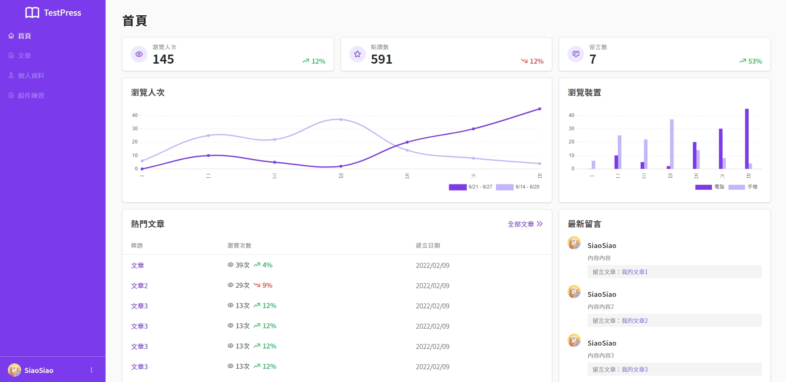

<h1 align="center">Backstage</h1>

  
  
  
  

<h2>
<a href="https://side-project-backstage.vercel.app/">
 demo here
</a>
</h2>

## 📄 Description

This project uses Vite as the build tool, Vue3 as the front-end framework, and TailwindCSS as the CSS framework to create a simple admin dashboard application. Through this project, developers can learn how to use Vue3 and TailwindCSS to quickly build web applications with admin management features.

## 📋 Project Structure

1. Login page: Provides a username and password input for implementing the login function to the admin dashboard.
2. Sidebar navigation: Includes quick navigation to various functional modules, such as user management, data analysis, settings, etc.
3. Header: Displays the current username and provides a logout function.
4. Content area: Showcases the content of various functional modules and provides corresponding operations as needed.

## 🚀 Features

- The page is developed with Vue.js framework.
- The page is use Tailwind CSS framework.
- Build tool use Vite.
- There is no database required.

## 📦 Setup & Development Server

1. Run `npm i` or `npm install` to install the Node.js dependencies.
2. Run `npm run dev` to run server. Server is listening on localhost:3000.
3. Open `http://localhost:3000/` in your browser.

